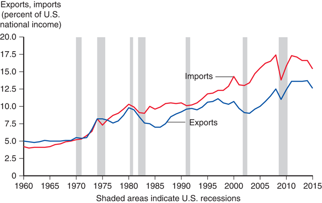
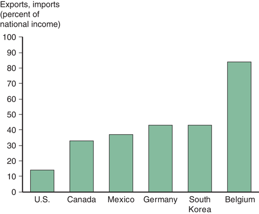
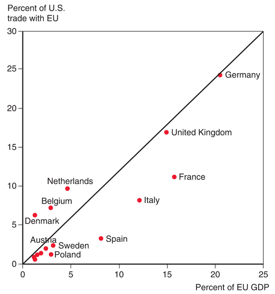
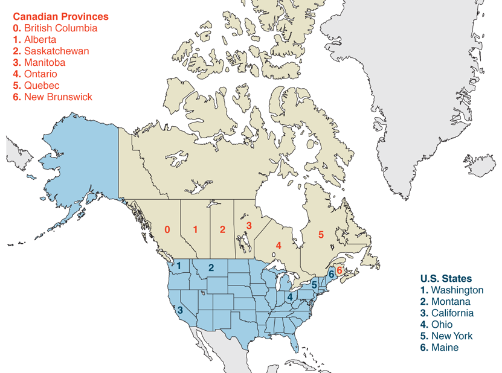
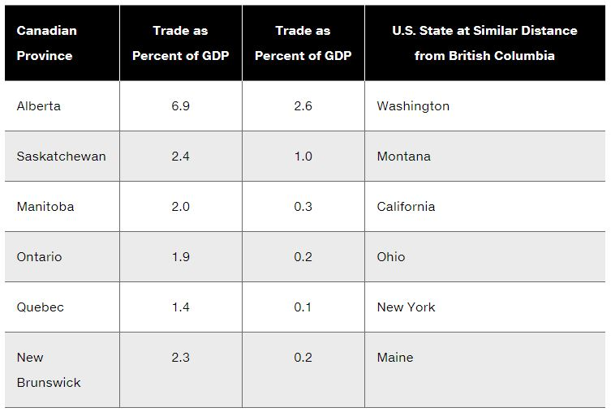

# Lecture 1: Introduction

**Instructor:** Fei Tan

 @econdojo &nbsp;&nbsp;&nbsp;&nbsp;  @BusinessSchool101 &nbsp;&nbsp;&nbsp;&nbsp;  Saint Louis University

**Course:** International Macroeconomics  
**Date:** December 28, 2025

---

## The Road Ahead

1. [World Trade: An Overview](#openess-of-u.s.-economy)
2. [Size Matters: Gravity Model](#size-matters)

---

## What Is International Economics About?

- A subject about how nations interact through trade of goods and services, flows of money, and investment
  - international trade: transactions of goods and services across nations
  - international finance: financial/monetary transactions across nations (our focus)

- **Why an important subject**
  - now more closely linked nations than ever before

- Main references
  - **KOM**: Krugman, Obstfeld & Melitz, "_International Economics: Theory and Policy_", 12th Edition (required)
  - **SUW**: Schmitt-Grohé, Uribe & Woodford, "_International Macroeconomics_" (required)

---

## Topics on International Trade

- Gains from trade
  - mutual benefits for countries as a whole
  - affect income distribution within a country

- Patterns of trade
  - who sells what to whom, e.g. Brazil exports coffee & Saudi Arabia exports oil
  - differences in climate, resources, labor productivity, etc.

- How much trade
  - trade policies, e.g. tariffs, quotas, export subsidies, etc.
  - cost and benefit analysis of trade policies

---

## Topics on International Finance

- Balance of payments
  - record a country's trade and financial flows
  - downloadable from [www.bea.gov](http://www.bea.gov)

- Exchange rate determination
  - price of domestic currency (goods) in terms of foreign currency (goods), or vice versa
  - fixed v.s. floating exchange rates

- International policy coordination
  - economic policies of one country can affect others
  - depend on exchange rate regime

- International capital market
  - e.g. foreign exchange market

---

## Openness of U.S. Economy

- Exports & imports as percentage of GDP (source: Bureau of Economic Analysis - BEA)
- U.S. international trade roughly tripled in past 50 years

---

## Openness of Other Economies

- Average of exports & imports as percentage of GDP (source: Organization for Economic Cooperation and Development - OECD)
- U.S. relies less on international trade than others

---

## Who Trades with Whom

- Total value of U.S. trade (exports+imports), 2015 (source: Department of Commerce)
- 15 countries accounted for 75% of U.S. trade

---

## Size Matters

**The gravity model**

$$T_{ij}=\frac{A\times Y_i^a\times Y_j^b}{D_{ij}^c}\quad\text{where}\quad A,\ a,\ b,\ c>0$$

- Analogous to Newton's law of gravity
  - $T_{ij}$ = trade value (gravity) between $i$ and $j$
  - $Y_k$ = country (object) $k$'s GDP (mass), $k=i,j$
  - $D_{ij}$ = distance between $i$ and $j$
  - estimates suggest $a,b,c\approx 1$

- Model predictions on trade volume
  - proportional to each country's GDP
  - diminish with distance between two countries

---

## Applying Gravity Model

- Size of Euro economies and their trade with U.S. (source: Department of Commerce, European Commission)
- Gravity model fits data well, but not perfectly

---

## Other Factors to Trade

- Distance
  - Canada/Mexico & U.S. (lower transportation cost)

- Borders
  - 1994 North American Free Trade Agreement (few tariffs/formalities)

- Cultural affinity
  - Ireland & U.S. (common language, migration history)

- Geography
  - Netherlands/Belgium & U.S. (near Rhine mouth)

- Multinational corporations
  - export and import among divisions

---

## Applying Gravity Model (Cont'd)

- U.S. trades markedly more with neighbors
- Distance matters

---

## Applying Gravity Model (Cont'd)

- Canadian provinces and U.S. states (source: Statistics Canada, Department of Commerce)
- Each pair has similar distance from British Columbia

---

## Border Matters (Cont'd)

- Trade with BC as percentage of province/state's GDP (source: Statistics Canada, Department of Commerce)
- Much larger province-wise than province-state trade

---

## What Do We Trade

- Composition of world trade, 2011 (source: World Trade Organization - WTO)
- Historically agricultural & mineral products made up most

---

## Readings & Exercises

- Readings
  - KOM: chapter 1, 2

- Exercises
  - KOM: problem 1, 2, 3, 4
