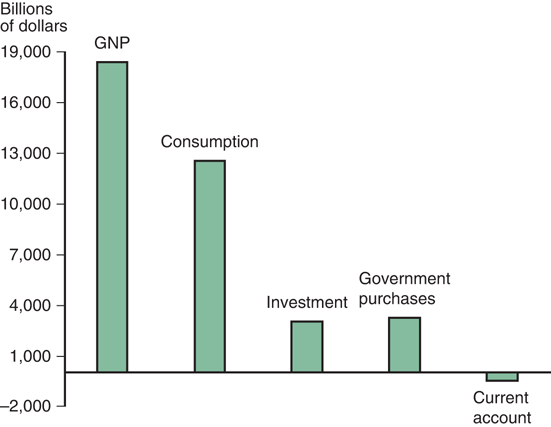
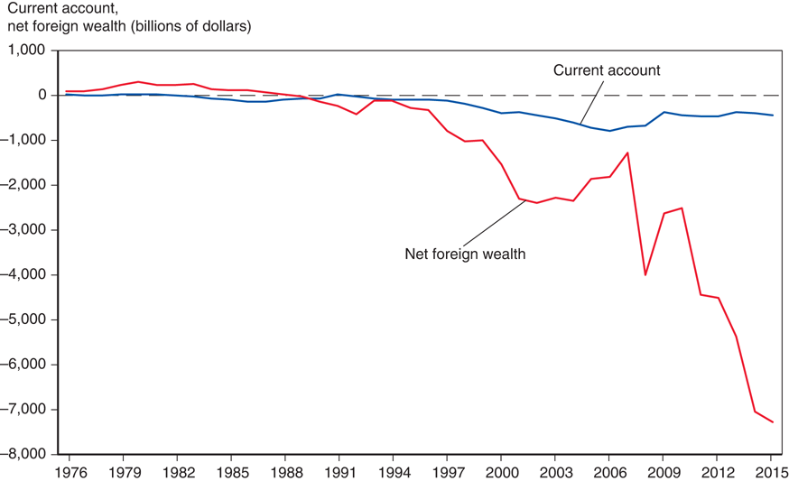
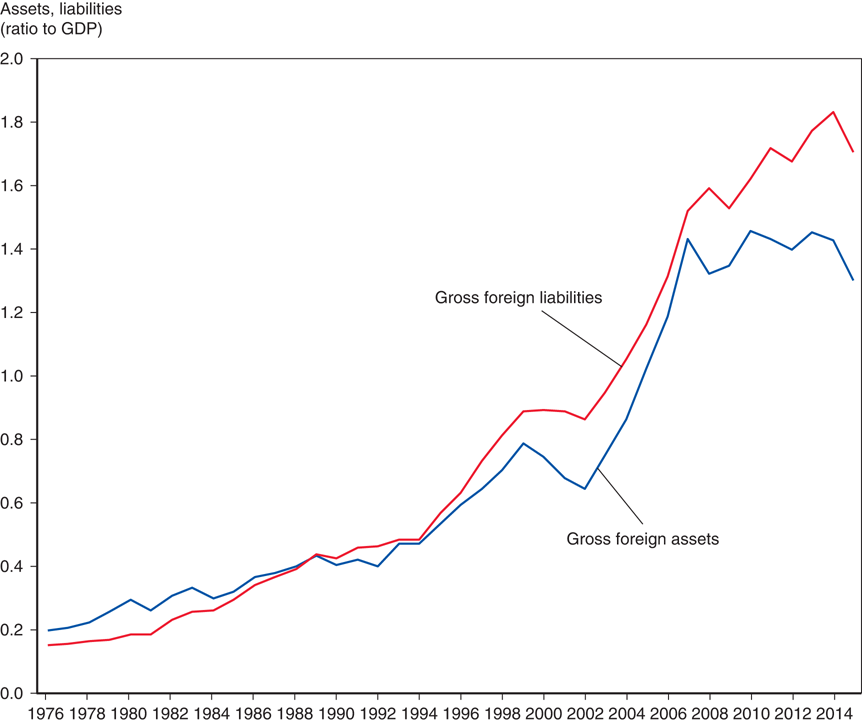

# Lecture 2: National Income Accounting and Balance of Payments

**Instructor:** Fei Tan

 @econdojo &nbsp;&nbsp;&nbsp;&nbsp;  @BusinessSchool101 &nbsp;&nbsp;&nbsp;&nbsp;  Saint Louis University

**Course:** International Macroeconomics  
**Date:** January 8, 2026

---

## What Is National Income Accounting?

- A classification of transactions that contribute to national income according to types of expenditure
  - consumption (C): expenditure by consumers
  - investment (I): expenditure by firms
  - government purchases (G): expenditure by gov't, not including transfer payments
  - current account balance (CA): net expenditure by foreigners, exports (EX) $-$ imports (IM)

- **An important identity**
  - national income = expenditure = production

---

## Measuring National Income

- Value of all final goods and services in a given period
  - gross national product (GNP): produced by a nation's factors of production, e.g. labor & capital (our focus)
  - gross domestic product (GDP): produced within a country's borders

- GNP & GDP are approximate measures, but not precise

- A more precise measure
  - net national product (NNP) = GNP $-$ depreciation
  - national income = NNP $+$ net unilateral transfers

---

## U.S. GNP

- 2016:Q1, Billions of dollars (source: BEA)
- Consumption is largest component of U.S. GNP

---

## The Road Ahead

1. [National Income Accounting](#national-income-accounting)
2. [Balance of Payments](#balance-of-payments)

---

## National Income Accounting

**National income identity**

$$\underbrace{Y}_{\text{GNP}}=\underbrace{C+I+G}_{\text{domestic expenditure}}+\underbrace{EX-IM}_{\text{net foreign expenditure}}$$

$$\Rightarrow\quad\underbrace{EX-IM}_{\text{current account (CA)}}=Y-(C+I+G)$$

- When production $>$ ($<$) domestic expenditure
  - surplus (deficit): $CA>(<)\ 0\Leftrightarrow EX>(<)\ IM$
  - lending (borrowing) $\Rightarrow$ net foreign wealth $\uparrow$ ($\downarrow$)

- International lending/borrowing $\Rightarrow$ _intertemporal_ trade

---

## U.S. Current Account, 1976-2015

- CA & net foreign wealth (or net international investment position), billions of dollars (source: BEA)
- Sustained CA deficits since early 1980s added up to large foreign debt

---

## Saving and Current Account

**National income identity**

$$\underbrace{S}_{\text{national saving}}=\underbrace{Y-T-C}_{\text{private saving}}+\underbrace{T-G}_{\text{gov't saving}}=\underbrace{I+CA}_{\text{total investment}}$$

- Some notations
  - $Y-T$ = disposable income, $T$ = taxes net of transfers
  - $S^p$ = private saving, $S^g$ = gov't saving
  - $G-T$ = primary deficit/newly issued gov't debt

- Ways to raise national wealth
  - Closed economy: only accumulate capital ($S=I$)
  - Open economy: also net foreign investment ($CA$)

- Borrow ($CA<0$) to invest more ($I>S$)

---

## Balance of Payments

- A set of accounts recording a country's receipts (credit) from and payments (debit) to foreigners
  - current account = exports $-$ imports $+$ net unilateral transfers of goods and services
  - financial account = sales (exports) of domestic assets to foreigners $-$ domestic purchases (imports) of foreign assets
  - capital account: special transfers of assets (small in quantity), e.g. debt forgiveness, migrants' transfers

- **Principle of double-entry bookkeeping**
  - each transaction enters accounts twice, once as credit ($+$) and once as debit ($-$)
  - current acc't $+$ capital acc't = $-$ financial acc't

---

## U.S. Balance of Payments, 2015

| | |
|:---|---:|
| **A. Current Account** [(1)-(2)+(3)] | **–462.97** |
| (1) Exports | **3,044.08** |
| &nbsp;&nbsp;Goods | 1,510.30 |
| &nbsp;&nbsp;Services | 750.86 |
| &nbsp;&nbsp;Income receipts (primary income) | 782.92 |
| (2) Imports | **3,362.06** |
| &nbsp;&nbsp;Goods | 2,272.87 |
| &nbsp;&nbsp;Services | 488.66 |
| &nbsp;&nbsp;Income payments (primary income) | 600.53 |
| (3) Net unilateral transfers (secondary income) | **–144.99** |
| **B. Financial Account** [(1)-(2)+(3)] | **195.23** |
| (1) Net U.S. incurrence of liabilities, excl. financial derivatives | **395.23** |
| &nbsp;&nbsp;Official reserve assets | –98.10 |
| &nbsp;&nbsp;Other assets | 493.33 |
| (2) Net U.S. acquisition of financial assets, excl. financial derivatives | **225.40** |
| &nbsp;&nbsp;Official reserve assets | –6.29 |
| &nbsp;&nbsp;Other assets | 231.69 |
| (3) Financial derivatives, net | **25.39** |
| **C. Capital Account** | **–0.04** |
| **Statistical Discrepancy** [–(A + B + C)] | **267.78** |

<small>Source: U.S. Department of Commerce, BEA, June 16, 2016, release (billions of dollars).</small>

---

## U.S. Gross Foreign Assets & Liabilities

- Ratio to GDP, 1976-2015 (source: BEA)
- U.S. is world's largest debtor nation

---

## Double-entry Bookkeeping: Example 1

| | Credit | Debit |
|:---|:---:|:---:|
| Current account, U.S. goods import | | $1,000 |
| &nbsp;&nbsp;&nbsp;&nbsp;(Fax machine purchase) | | |
| Financial account, U.S. asset sale | $1,000 | |
| &nbsp;&nbsp;&nbsp;&nbsp;(Sale of bank deposit) | | |

- We purchase a fax machine from Italian company Olivetti
- Olivetti deposits our check in a U.S. bank

---

## Double-entry Bookkeeping: Example 2

| | Credit | Debit |
|:---|:---:|:---:|
| Current account, U.S. service import | | $200 |
| &nbsp;&nbsp;&nbsp;&nbsp;(Meal purchase) | | |
| Financial account, U.S. asset sale | $200 | |
| &nbsp;&nbsp;&nbsp;&nbsp;(Sale of credit card claim) | | |

- We buy lunch in France and pay by credit card issued by American bank

---

## Double-entry Bookkeeping: Example 3

| | Credit | Debit |
|:---|:---:|:---:|
| Financial account, U.S. asset purchase | | $95 |
| &nbsp;&nbsp;&nbsp;&nbsp;(Stock purchase) | | |
| Financial account, U.S. asset sale | $95 | |
| &nbsp;&nbsp;&nbsp;&nbsp;(Sale of bank deposit) | | |

- We purchase a share of British Petroleum (BP) stock
- BP deposits money in a U.S. bank

---

## Double-entry Bookkeeping: Example 4

| | Credit | Debit |
|:---|:---:|:---:|
| Financial account, U.S. asset purchase | | $80 |
| &nbsp;&nbsp;&nbsp;&nbsp;(Stock purchase) | | |
| Financial account, U.S. asset purchase | $80 | |
| &nbsp;&nbsp;&nbsp;&nbsp;(Reduction in foreign check claim) | | |

- We purchase a share of German stock and pay by check on Swiss bank account

---

## Double-entry Bookkeeping: Example 5

| | Credit | Debit |
|:---|:---:|:---:|
| Financial account, U.S. asset sale | | $1,000 |
| &nbsp;&nbsp;&nbsp;&nbsp;(Reduction in sale of dollars) | | |
| Current account, U.S. goods export | $1,000 | |
| &nbsp;&nbsp;&nbsp;&nbsp;(Goods sale) | | |

- Foreign exchange intervention: Korean government uses dollars in American bank account to buy Korean currency from its citizens
- Korean citizens use dollars to buy American goods

---

## Double-entry Bookkeeping: Example 6

| | Credit | Debit |
|:---|:---:|:---:|
| Capital account, U.S. transfer payment | | $5,000 |
| &nbsp;&nbsp;&nbsp;&nbsp;(Debt forgiveness) | | |
| Financial account, U.S. asset purchase | $5,000 | |
| &nbsp;&nbsp;&nbsp;&nbsp;(Reduction in foreign assets holding) | | |

- U.S. bank forgives debt owed by Argentina government through debt restructing

---

## Readings & Exercises

- Readings
  - KOM: chapter 13

- Exercises
  - KOM: problem 1, 2, 3, 4
