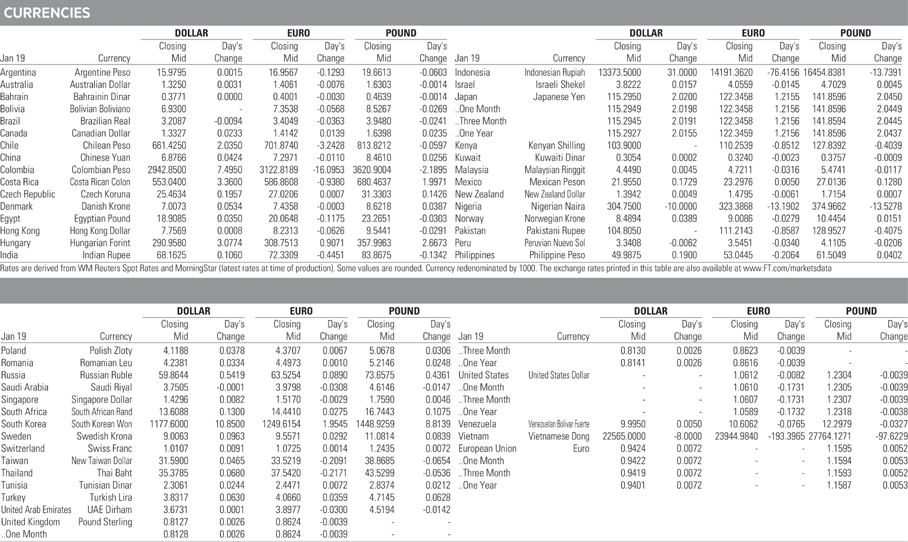
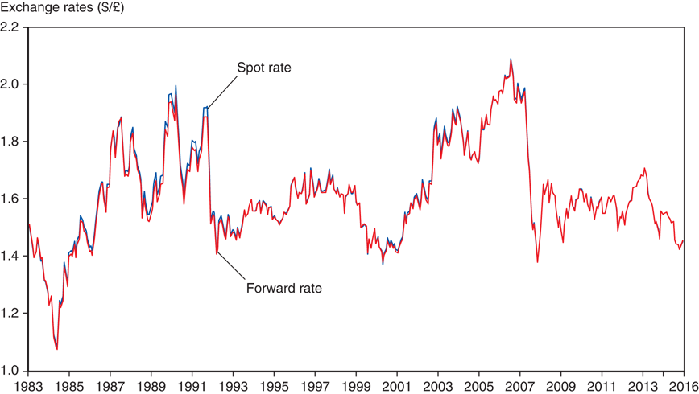
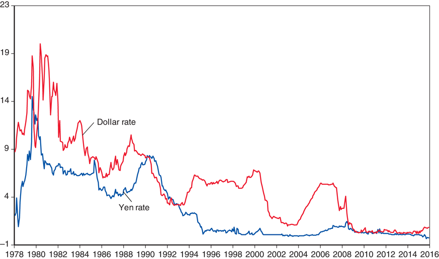
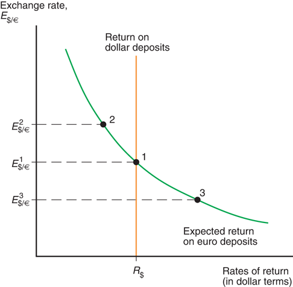
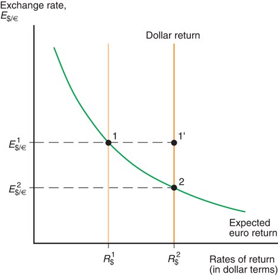
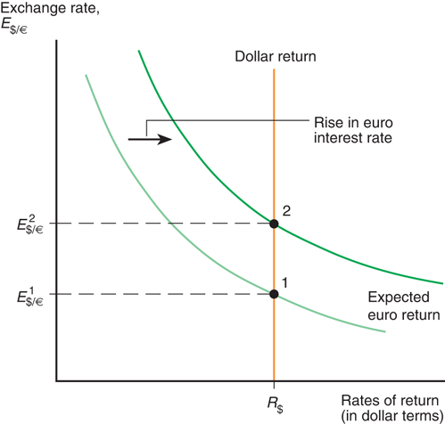

# Lecture 3: Exchange Rates and Foreign Exchange Market

**Instructor:** Fei Tan

 @econdojo &nbsp;&nbsp;&nbsp;&nbsp;  @BusinessSchool101 &nbsp;&nbsp;&nbsp;&nbsp;  Saint Louis University

**Course:** International Macroeconomics  
**Date:** January 17, 2026

---

## The Road Ahead

1. [Introduction](#what-is-exchange-rate)
2. [Demand for Currency Deposits](#asset-returns)
3. [Equilibrium in Foreign Exchange Market](#equilibrium-exchange-rate)

---

## What Is Exchange Rate?

- A rate at which one currency exchanges for another

  - how much yen is one dollar? (¥97.385/$)

    $\Rightarrow$ **price** of domestic currency in foreign currency
  - how much dollar is one yen? ($0.01027/¥)

    $\Rightarrow$ **price** of foreign currency in domestic currency

- Why is it important

  - comparing prices of goods/services produced in different countries becomes easy
  - $22,000 Ford v.s. ¥2,500,000 Nissan
  - ¥2,500,000 "=" $2,500,000×0.01027

---

## Exchange Rate Quotations

- Source: Financial Times, January 20, 2017

---

## Changes in Exchange Rates

- Depreciation: decrease in value of one currency <u>relative</u> to another

  - $1/€ $\uparrow$ $1.2/€ : dollar becomes less valuable relative to euro
  - a Nissan costs more as dollar depreciates from $0.01027/¥ to $0.011185/¥
  - price of exports $\downarrow$ relative to price of imports

- Appreciation: increase in value of one currency <u>relative</u> to another

- Domestic currency depreciates (appreciates) $\Leftrightarrow$ foreign currency appreciates (depreciates)

---

## Foreign Exchange Markets

- A set of markets where participants buy and sell foreign currencies

  - commercial banks (retail v.s. wholesale rates)
  - non-bank financial institutions (e.g. mutual funds)
  - non-financial businesses (e.g. corporations)
  - central banks

- **Arbitrage** $\Rightarrow$ no significant difference in exchange rates across locations

- Other methods of currency exchange: swaps, futures, options

---

## Spot Rate v.s. Forward Rate

- Dollar/pound spot and forward (90-day) exchange rates, 1983-2016 (source: Datastream)

---

## Asset Returns

- Nominal rate of return: percentage change in monetary value of an asset during a time period

  - e.g. stock price = $100 today, dividend = $1, stock price = $109 next year
  
  $$\text{nominal rate of return}=\frac{(\$109+\$1)-\$100}{\$100}=10\%$$

- Real rate of return $-$ inflation-adjusted rate of return

  - _ex-ante_ real rate $\approx$ nominal rate $-$ expected inflation
  - _ex-post_ real rate $\approx$ nominal rate $-$ actual inflation

- Demand for assets primarily depends on rate of return

  - secondary factors: risk, liquidity, etc.

---

## Currency Returns

- Two pieces of information needed to compare currency returns (e.g. dollar v.s. euro)

  - interest rate on each currency ($ rate = 2%, € rate = 4%)
  - expected change in exchange rate (from $1/€ to $0.97/€)

- Which currency is more desirable?

  - step 1: dollar rate of return in dollar = 2%
  - step 2: euro rate of return in dollar
  
  $$\frac{\$1}{\$1/\text{€}}\times(1+4\%)\times\$0.97/\text{€}-\$1=0.88\%$$
  
  - step 3: 2% $>$ 0.88% $\Rightarrow$ hold dollar

---

## Interest Rates on Dollar and Yen

- Annualized 3-month interest rates (source: Datastream)

---

## Currency Returns (Cont'd)

**A useful approximation**

$$\text{euro return in dollar}\approx R_{\text{€}}+\underbrace{\frac{E_{\text{\$/€}}^e-E_{\text{\$/€}}}{E_{\text{\$/€}}}}_{\text{expected rate of euro appreciation}}$$

- Some notations

  - $R_{\text{€}}$ = today's euro interest rate
  - $R_{\text{\$}}$ = today's dollar interest rate
  - $E_{\text{\$/€}}$ = today's dollar/euro exchange rate
  - $E_{\text{\$/€}}^e$ = expected dollar/euro exchange rate next year

- What if we measure both returns in euro?

---

## Equilibrium Exchange Rate

**Interest parity condition**

$$\underbrace{R_{\text{\$}}}_{\text{dollar return in dollar}}= \underbrace{R_{\text{€}}+\frac{E_{\text{\$/€}}^e-E_{\text{\$/€}}}{E_{\text{\$/€}}}}_{\text{euro return in dollar}}\quad (\text{no arbitrage})$$

- Equilibrium happens when interest parity holds

  - suppose not, e.g. LHS $>$ RHS
  - excess supply for € $\Rightarrow$ dollar price of euro $\downarrow$
  - excess demand for $ $\Rightarrow$ euro price of dollar $\uparrow$
  - $E_{\text{\$/€}}$ $\downarrow$ until LHS = RHS

---

## Equilibrium Exchange Rate (Cont'd)

- Graphical illustration of interest parity condition
- Exogenous: ($R_{\$}$, $R_{\text{€}}$, $E_{\text{\$/€}}^e$); endogenous: $E_{\text{\$/€}}$

---

## Effect of Higher Dollar Rate

- Excess demand for dollar, excess supply of euro
- Dollar appreciates ($E_{\text{\$/€}}$ $\downarrow$) to restore equilibrium

---

## Effect of Higher Euro Rate

- Excess demand for euro, excess supply of dollar
- Euro appreciates ($E_{\text{\$/€}}$ $\uparrow$) to restore equilibrium
---

## Readings & Exercises

- Readings
  - KOM: chapter 14

- Exercises
  - KOM: problem 1, 5
  - Derive interest parity condition
  - What is effect of expected euro appreciation? Has euro actually appreciated? (self-fulfilling prophecy)
