# Lecture 4: Money, Interest Rates, and Exchange Rates

**Instructor:** Fei Tan

 @econdojo &nbsp;&nbsp;&nbsp;&nbsp;  @BusinessSchool101 &nbsp;&nbsp;&nbsp;&nbsp;  Saint Louis University

**Course:** International Macroeconomics  
**Date:** February 1, 2026

---

## What Is Money?

- Money is a liquid/monetary asset
  - narrow measure
    $$\text{M1 = currency + checkable deposits}$$
  - broader measure includes less liquid/non-monetary assets
  - measure money supply by M1, controlled by Fed

- **Why is it important**
  - Wicksell (1934), "Lectures on Political Economy"
  - Kiyotaki & Moore (2002), "Evil is the Root of All Money"

- Functions of money: medium of exchange, unit of account, store of value

---

## What Is Cryptocurrency?

- Decentralized digital money designed to be used over internet, e.g. Bitcoin, Ethereum, Dogecoin
  - transfer value online without a bank/payment processor
  - managed by peer-to-peer networks of computers
  - secured by blockchain---constantly re-verified ledger of all transactions, distributed over network

- **Why is it the future of finance**
  - buy goods/services or invest
  - not manipulated by central authority
  - equal opportunity to anyone with internet access
  - economic freedom around world

---

## Bitcoin Daily Volume

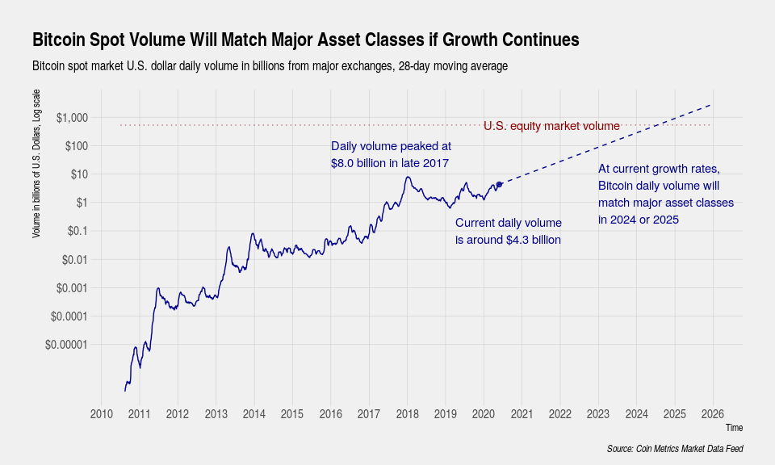

---

## The Road Ahead

1. [Aggregate Demand for Money](#aggregate-money-demand)
2. [Equilibrium in Money Market](#equilibrium-interest-rate)
3. [Money and Exchange Rate in Short Run](#money-and-exchange-rate-in-short-run)
4. [Money and Exchange Rate in Long Run](#long-run-neutrality-of-money)

---

## Aggregate Money Demand

**Money demand function**

$$M^d=P\times L(\mathop{R}_{(-)},\mathop{Y}_{(+)})\quad\text{or}\quad\frac{M^d}{P}=L(\mathop{R}_{(-)},\mathop{Y}_{(+)})$$

- Three main factors determine $M^d$
  - $R$ = interest rate on non-monetary assets (opportunity cost/price of holding money)
  - $Y$ = real national income
  - $P$ = general price level

- Exogenous: ($Y$, $P$, $M^s$); endogenous: ($M^d$, $R$)

---

## Aggregate Money Demand (Cont'd)

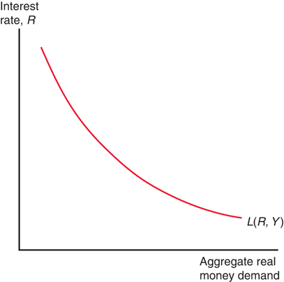

- Real money demand rises as interest rate falls
- Movement along curve

---

## Aggregate Money Demand (Cont'd)

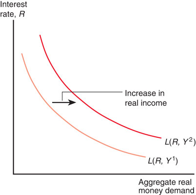

- Real money demand rises at each interest rate
- Shift of curve

---

## Equilibrium Interest Rate

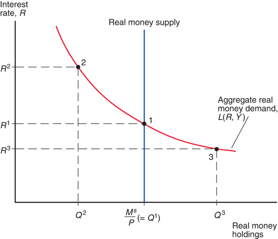

- Money market equilibrium happens when $M^s=M^d$

- Monetary assets v.s. interest-bearing assets

---

## Money Supply and Interest Rate

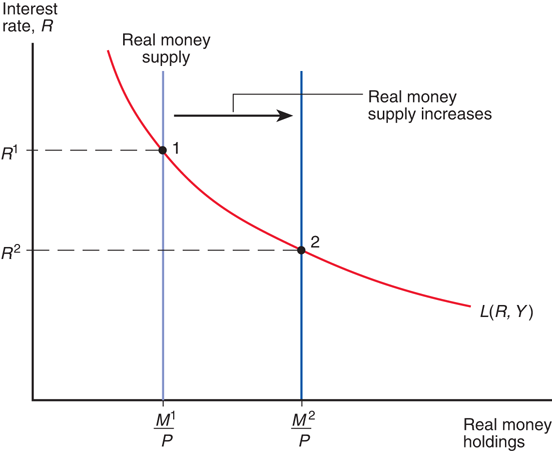

- Given $(Y,P)$, monetary expansion ($M^s\uparrow$) lowers $R$

- What about monetary contraction ($M^s\downarrow$)?

---

## Output and Interest Rate

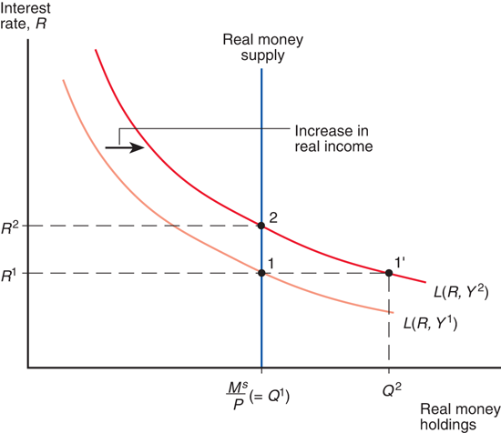

- Given $(M^s,P)$, higher economic activity ($Y\uparrow$) raises $R$

- What about lower economic activity ($Y\downarrow$)?

---

## Money and Exchange Rate in Short Run

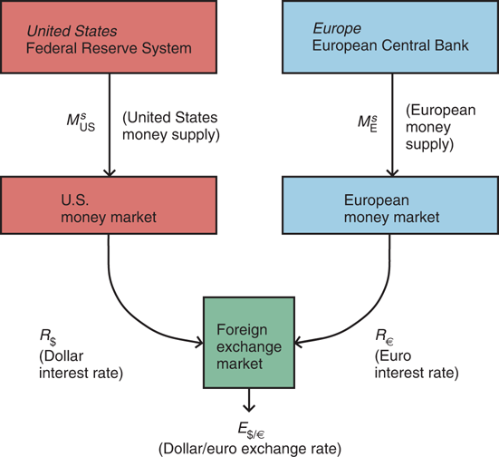

- Simultaneous equilibrium in money market and foreign exchange market

- Exogenous: ($Y$, $P$, $M^s$, $E^e$); endogenous: ($M^d$, $R$, $E$)

---

## Simultaneous Equilibrium

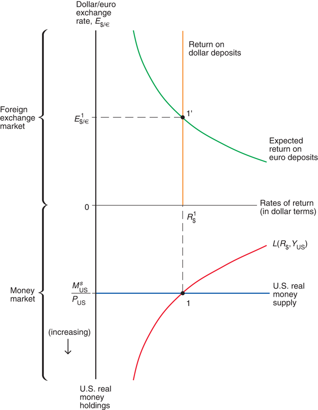

---

## Money Supply & Exchange Rate

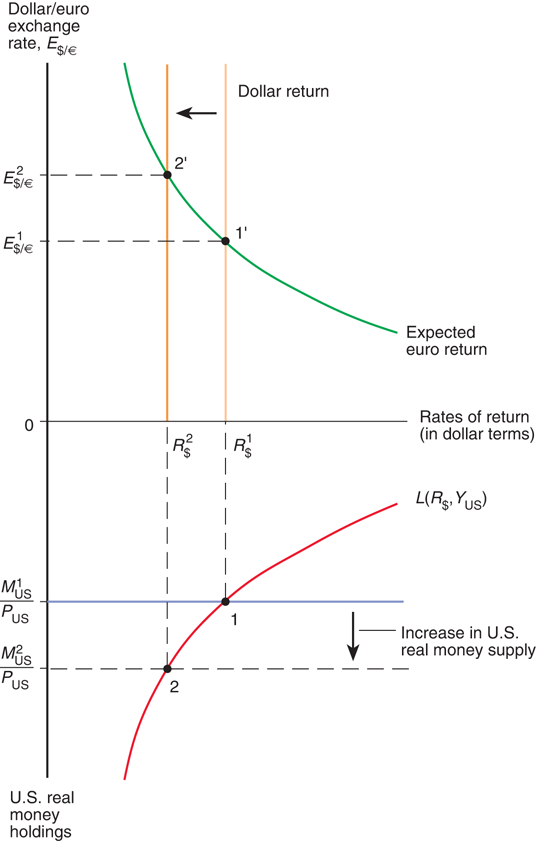

---

## Money Supply & Exchange Rate (Cont'd)

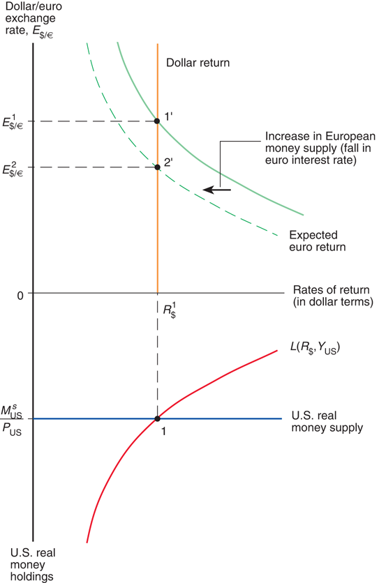

---

## Long-Run Neutrality of Money

**Money market equilibrium**

$$P=\frac{M^s}{L(R,Y)}\quad\Rightarrow\quad\%\Delta P=\%\Delta M^s-\%\Delta L$$

- Long-run effects of one-time level change in $M^s$
  - $R$ = natural real interest rate + long-run inflation
  - $Y$ = full-employment real output
  - no change in $(R,Y)$ $\Rightarrow$ $(P,E)$ changes in proportion
  - changes in $M^s$ growth need not be neutral

- As Milton Friedman put it, "inflation is always and everywhere a monetary phenomenon"

---

## Evidence on Money Neutrality

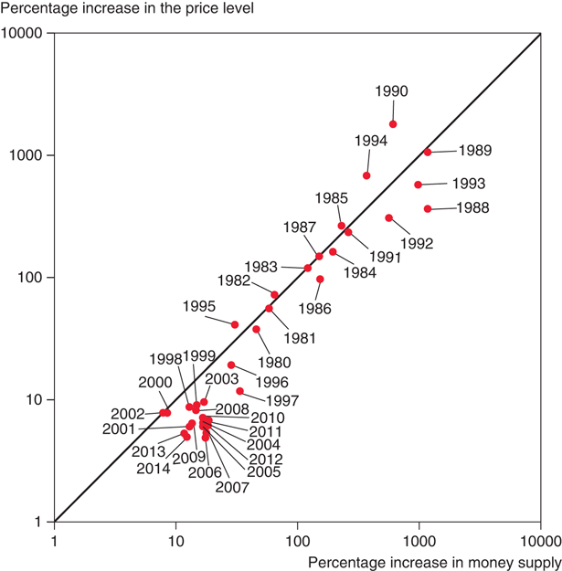

- Average money growth and inflation in Latin American, 1987-2007 (source: IMF)

---

## From Short to Long-Run

**Price-setting relation (PS)**

$$P=(1+m)\times W,\quad\text{$m$ = markup of price over wage}$$

- **Short-run price rigidity**
  - wages are written into long-term contracts
  - wage stickiness $\Rightarrow$ price stickiness by PS

- **Long-run price flexibility**
  - $M^s\uparrow$ creates excess demand for output and labor, inflationary expectations, as well as higher raw materials prices
  - "wage-price spiral" by PS

- Exogenous: ($Y$, $M^s$); endogenous: ($M^d$, $R$, $P$, $E$, $E^e$)

---

## Inflation and Exchange Rate Dynamics

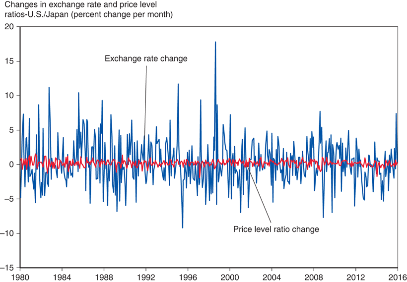

- Percent changes in dollar/yen exchange rate and price ratio--U.S./Japan (source: IMF)
- Exchange rate overshooting

---

## From Short-Run to Long-Run (Cont'd)

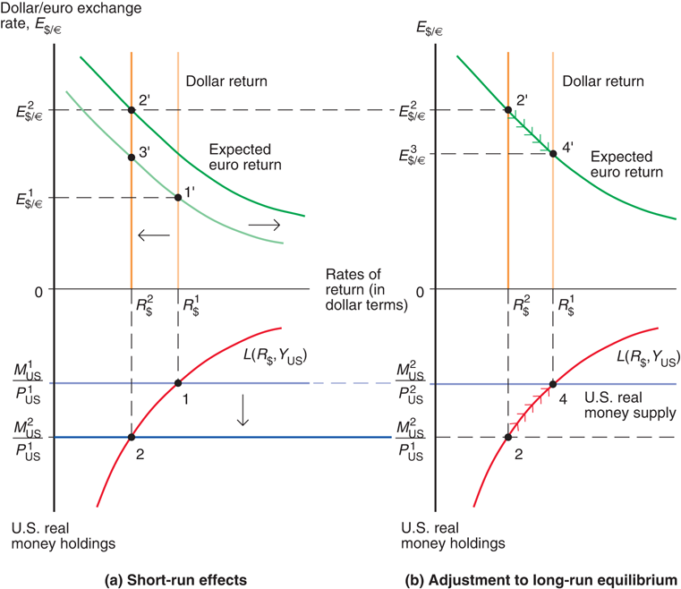

---

## Impulse Responses of Key Variables

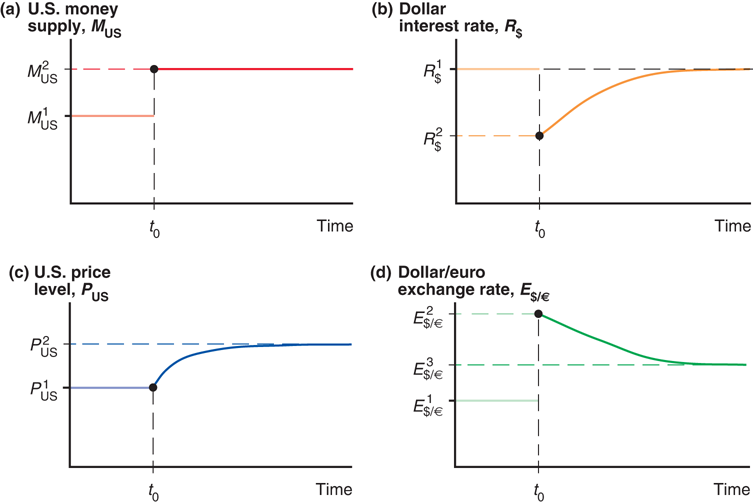

---

## Readings & Exercises

- **Readings**
  - KOM: chapter 15

- **Exercises**
  - KOM: problem 1, 2, 3, 4
  - Would exchange rate still be so volatile if price level were perfectly flexible?
