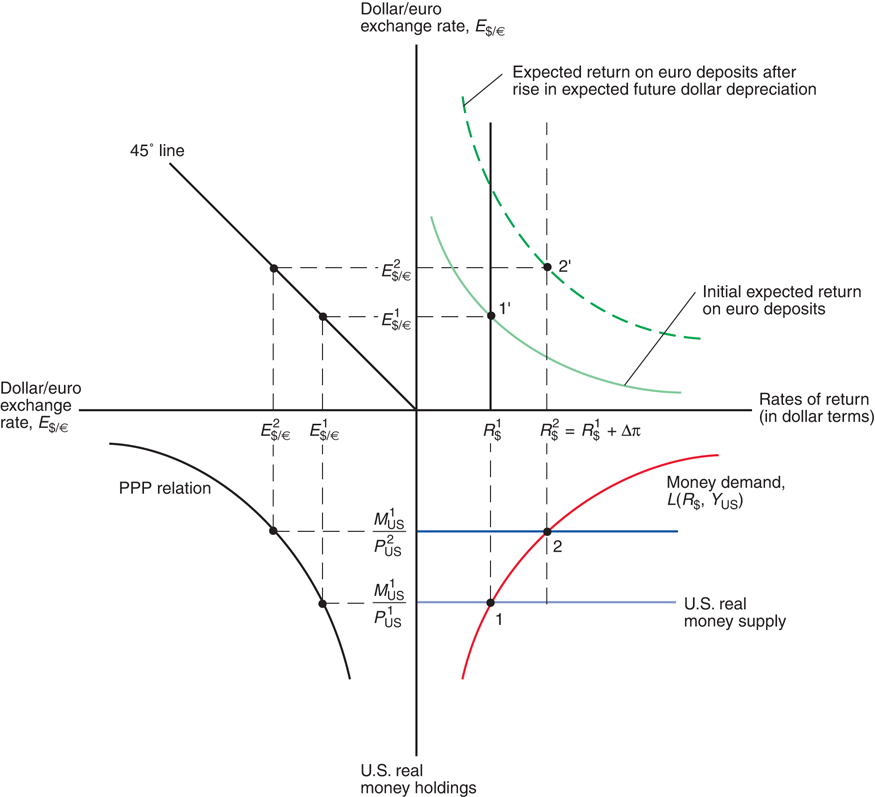
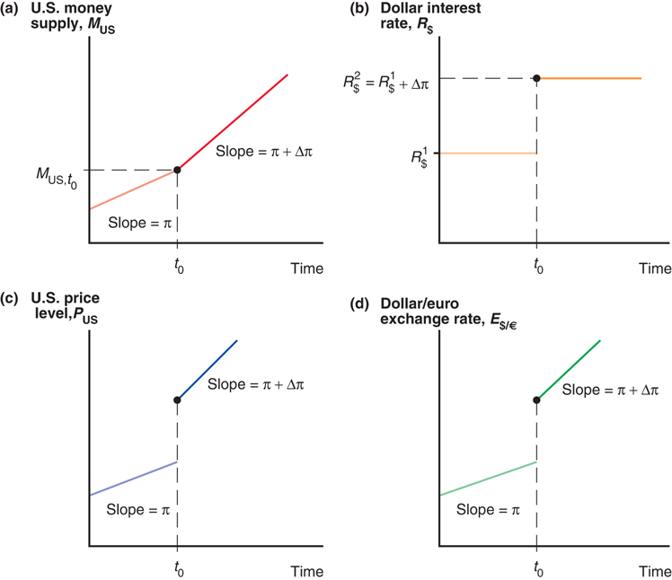
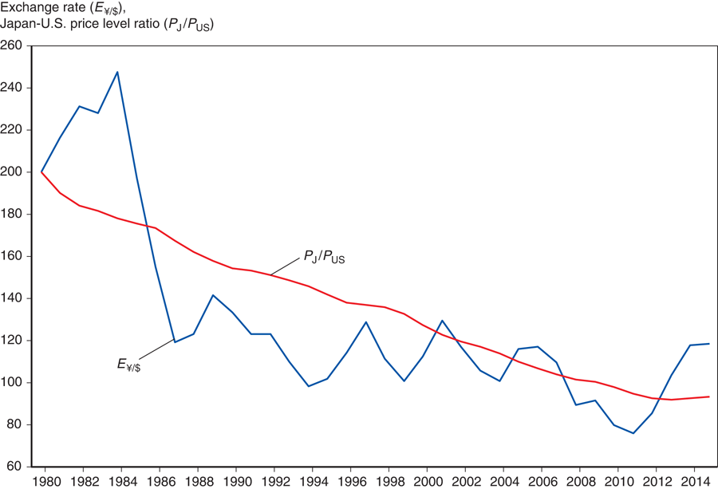
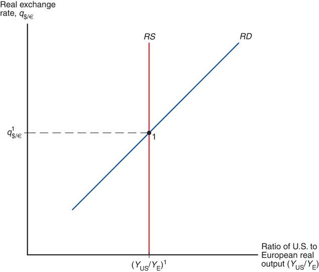

# Lecture 5: Price Levels and Exchange Rate in Long Run

**Instructor:** Fei Tan

 @econdojo &nbsp;&nbsp;&nbsp;&nbsp;  @BusinessSchool101 &nbsp;&nbsp;&nbsp;&nbsp;  Saint Louis University

**Course:** International Macroeconomics  
**Date:** February 1, 2026

---

## LOOP & PPP

**No arbitrage condition**

$$P_{\$}=E_{\$/\text{€}}\times P_{\text{€}}\quad\Rightarrow\quad E_{\$/\text{€}}=\frac{P_{\$}}{P_{\text{€}}}$$

- Law of One Price (LOOP)

  - $P_{\$}$ = dollar price of a single good
  - $P_{\text{€}}$ = euro price of identical good

- Absolute Purchasing Power Parity (PPP)

  - $P_{\$}$ = dollar price of a basket of goods
  - $P_{\text{€}}$ = euro price of identical basket of goods
  - absolute PPP implies relative PPP
    $$\%\Delta E_{\$/\text{€}}\approx\%\Delta P_{\$}-\%\Delta P_{\text{€}}$$

---

## The Road Ahead

1. [Monetary Approach to Exchange Rates](#monetary-approach-to-exchange-rates)
2. [A General Model of Long-Run Exchange Rates](#real-exchange-rate)

---

## Monetary Approach to Exchange Rates

**A long-run exchange rate model**

$$E_{\$/\text{€}}=\frac{P_{\$}}{P_{\text{€}}}=\frac{M_{\$}^s}{M_{\text{€}}^s}\times\frac{L(R_{\text{€}},Y_{\text{€}})}{L(R_{\$},Y_{\$})}$$

- Use monetary factors to predict long-run exchange rates, _assuming_ absolute PPP

- Predictions of monetary approach

  - $M_{\$}^s\uparrow$ $\Rightarrow$ $P_{\$}\uparrow$ $\Rightarrow$ $E_{\$/\text{€}}\uparrow$ in proportion
  - $R_{\$}\uparrow$ $\Rightarrow$ $L(R_{\$},Y_{\$})\downarrow$ $\Rightarrow$ $P_{\$}\uparrow$ $\Rightarrow$ $E_{\$/\text{€}}\uparrow$
  - $Y_{\$}\uparrow$ $\Rightarrow$ $L(R_{\$},Y_{\$})\uparrow$ $\Rightarrow$ $P_{\$}\downarrow$ $\Rightarrow$ $E_{\$/\text{€}}\downarrow$

- Does $R_{\$}\uparrow$ $\Rightarrow$ $E_{\$/\text{€}}\uparrow$ contradict Lecture 4 result?

---

## Fisher Effect

**IP + PPP**

$$\rlap{\overbrace{\phantom{R_{\$}-R_{\text{€}}=\frac{E_{\$/\text{€}}^e-E_{\$/\text{€}}}{E_{\$/\text{€}}}}}^{\text{Interest Parity (IP)}}} R_{\$}-R_{\text{€}}= \underbrace{\frac{E_{\$/\text{€}}^e-E_{\$/\text{€}}}{E_{\$/\text{€}}}=\underbrace{\frac{P_{\$}^e-P_{\$}}{P_{\$}}}_{\pi_{\$}^e}-\underbrace{\frac{P_{\text{€}}^e-P_{\text{€}}}{P_{\text{€}}}}_{\pi_{\text{€}}^e}}_{\text{``expected'' version of relative PPP}}$$

- What is Fisher effect?

  - long-run relation b/w inflation & interest rate
  - e.g. $\pi_{\$}^e\uparrow$ by 5% $\Rightarrow$ $R_{\$}\uparrow$ by 5%

- Secret behind interest rate rise

  - sticky price: $M_{\$}^s\downarrow$ $\Rightarrow$ $(P_{\$}^e,E_{\$/\text{€}}^e)\downarrow$+$R_{\$}\uparrow$ $\Rightarrow$ $E_{\$/\text{€}}\downarrow$
  - flexible price: $g_{M_{\$}^s}\uparrow$ $\Rightarrow$ $(\pi_{\$}^e,E_{\$/\text{€}}^e)\uparrow$+$R_{\$}\uparrow$ $\Rightarrow$ $E_{\$/\text{€}}\uparrow$

---

## Monetary Approach

---

## Monetary Approach (Cont'd)

---

## Failure of PPP

- transport costs, trade barriers, nontradables
- departures from free competition
- differences in price level measurement

---

## Real Exchange Rate

- What is real exchange rate?

  - price of foreign goods in domestic goods
    

    
    $$q_{\$/\text{€}}=E_{\$/\text{€}}\times P_{\text{€}}/P_{\$}$$
    
    

  - $q_{\$/\text{€}}\uparrow$ ($\downarrow$) means real depreciation (appreciation) of dollar against euro

- PPP implies unchanged $q_{\$/\text{€}}$

  - absolute PPP holds if $q_{\$/\text{€}}=1$
  - relative PPP holds if $\%\Delta q_{\$/\text{€}}=0$ or
    $$\underbrace{\%\Delta P_{\$}-\%\Delta P_{\text{€}}}_{\text{inflation differential}}=\underbrace{\%\Delta E_{\$/\text{€}}}_{\text{depreciation rate of dollar}}$$

---

## Long-Run Real Exchange Rate

- Equilibrium $q_{\$/\text{€}}$ occurs when relative demand (RD) equals relative supply (RS)

---

## Real Exchange Rate Approach

**A long-run exchange rate model**

$$E_{\$/\text{€}}=q_{\$/\text{€}}\times\frac{P_{\$}}{P_{\text{€}}}={\color{red}q_{\$/\text{€}}}\times\frac{M_{\$}^s}{M_{\text{€}}^s}\times\frac{L(R_{\text{€}},Y_{\text{€}})}{L(R_{\$},Y_{\$})}$$

- Generalize monetary approach to determining long-run exchange rates, allowing for deviations from PPP

- **Predictions of real exchange rate approach**

  - $M_{\$}^s\uparrow$ in level $\Rightarrow$ $(q_{\$/\text{€}},R_{\$},Y_{\$})$ no change $\Rightarrow$ $(P_{\$},E_{\$/\text{€}})\uparrow$ in proportion (relative PPP)
  - $M_{\$}^s\uparrow$ in growth $\Rightarrow$ $(q_{\$/\text{€}},Y_{\$})$ no change, $R_{\$}\uparrow$ $\Rightarrow$ $(P_{\$},E_{\$/\text{€}})\uparrow$ in proportion (relative PPP)
  - $RD\uparrow$ $\Rightarrow$ $(R_{\$},Y_{\$},P_{\$})$ no change $\Rightarrow$ $(q_{\$/\text{€}},E_{\$/\text{€}})\downarrow$
  - $RS\uparrow$ $\Rightarrow$ $L(R_{\$},Y_{\$})\uparrow$, $P_{\$}\downarrow$, $q_{\$/\text{€}}\uparrow$ $\Rightarrow$ $E_{\$/\text{€}}$ ?

---

## A Summary

| **Change** | **Long-run** $E_{\$/\text{€}}$ |
|:---|:---|
| **Money market** | |
| 1. Increase in U.S. money supply level | Proportional increase |
| 2. Increase in European money supply level | Proportional decrease |
| 3. Increase in U.S. money supply growth | Increase |
| 4. Increase in European money supply growth | Decrease |
| **Output market** | |
| 1. Increase in demand for U.S. output | Decrease |
| 2. Increase in demand for European output | Increase |
| 3. Output supply increase in U.S. | Ambiguous |
| 4. Output supply increase in Europe | Ambiguous |

---

## A Second Look on Fisher Effect

**International interest rate gap**

$$\rlap{\overbrace{\phantom{R_{\$}-R_{\text{€}}=\frac{E_{\$/\text{€}}^e-E_{\$/\text{€}}}{E_{\$/\text{€}}}}}^{\text{Interest Parity (IP)}}} R_{\$}-R_{\text{€}}= \underbrace{\frac{E_{\$/\text{€}}^e-E_{\$/\text{€}}}{E_{\$/\text{€}}}=\frac{q_{\$/\text{€}}^e-q_{\$/\text{€}}}{q_{\$/\text{€}}}+(\pi_{\$}^e-\pi_{\text{€}}^e)}_{\text{from definition of real exchange rate}}$$

- Fisher effect: long-run relation among inflation, nominal & real interest rates

- Real interest parity condition
  $$r_{\$}-r_{\text{€}}=(R_{\$}-\pi_{\$}^e)-(R_{\text{€}}-\pi_{\text{€}}^e)=\frac{q_{\$/\text{€}}^e-q_{\$/\text{€}}}{q_{\$/\text{€}}}$$

---

## Readings & Exercises

- Readings
  - KOM: chapter 16

- Exercises
  - KOM: problem 1, 2, 3, 4
  - Derive real interest parity condition
  - What is international _real_ interest rate gap when relative PPP is expected to hold?
