# Lecture 6: Output and Exchange Rate in Short Run

**Instructor:** Fei Tan

 @econdojo &nbsp;&nbsp;&nbsp;&nbsp;  @BusinessSchool101 &nbsp;&nbsp;&nbsp;&nbsp;  Saint Louis University

**Course:** International Macroeconomics  
**Date:** February 1, 2026

---

## Aggregate Demand in Open Economy

**Aggregate demand equation**

$$D=C(Y-\overline{T})+\overline{I}+\overline{G}+CA(EP^*/P,Y-\overline{T})=D(\underbrace{q=EP^*/P}_{(+)},\underbrace{Y-\overline{T}}_{(+)},\overline{I},\overline{G})$$

- Determinants of aggregate demand

  - consumption: $C=C(Y^d)$, $Y^d=Y-\overline{T}$

    remark: $Y^d\uparrow$ $\Rightarrow$ $C\uparrow$ less than one-for-one

  - investment: $I=\overline{I}$, government purchases: $G=\overline{G}$

  - current account: $CA=CA(q,Y^d)$

    remark 1: $IM=q\times EX^*$ measured in domestic output

    remark 2: $q\uparrow$ $\Rightarrow$ $EX\uparrow$, $IM\downarrow$ (?) $\Rightarrow$ $CA\uparrow$ (Marshall-Lerner condition)

    remark 3: $Y^d\uparrow$ $\Rightarrow$ $IM\uparrow$ $\Rightarrow$ $CA\downarrow$

---

## Aggregate Demand Function

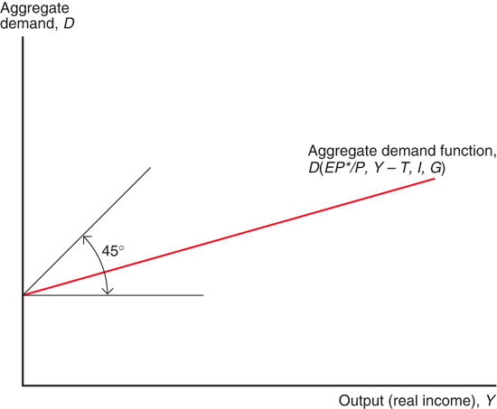

- Why AD function slopes positive but less than one?

- $Y\uparrow$ $\Rightarrow$ $C\uparrow\ >\ IM\uparrow$ $\Rightarrow$ $D\uparrow$ less than one-for-one

---

## Short-Run Equilibrium Output

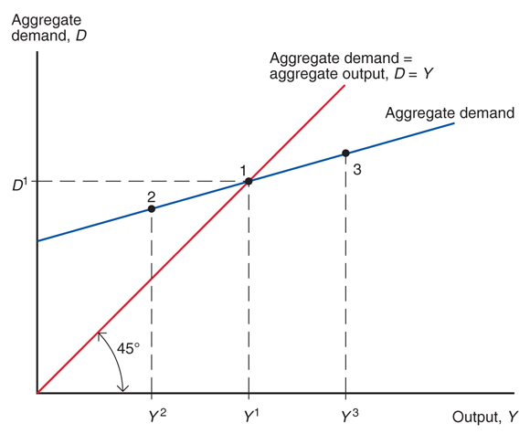

- Equilibrium occurs when $Y=D(EP^*/P,Y-\overline{T},\overline{I},\overline{G})$

- Exogenous: $(EP^*/P,I,T,G)$; endogenous: $Y$

---

## The Road Ahead

1. [Output Market Equilibrium](#output-effect-of-currency-depreciation)
2. [Asset Market Equilibrium](#currency-effect-of-higher-output)
3. [Equilibrium of All Markets](#equilibrium-output-and-exchange-rate)
4. [Monetary and Fiscal Policy](#temporary-monetary-expansion)
5. [Miscellaneous](#j-curve)

---

## Output Effect of Currency Depreciation

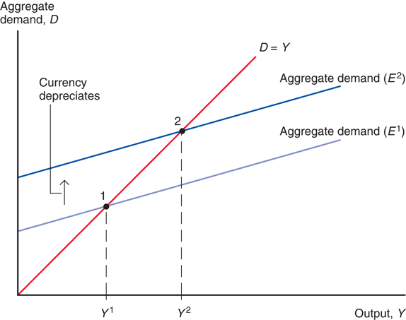

- All else equal, higher exchange rate raises output

- Exogenous: $(P,P^*,I,T,G)$; endogenous: $(Y,E)$

---

## DD Schedule

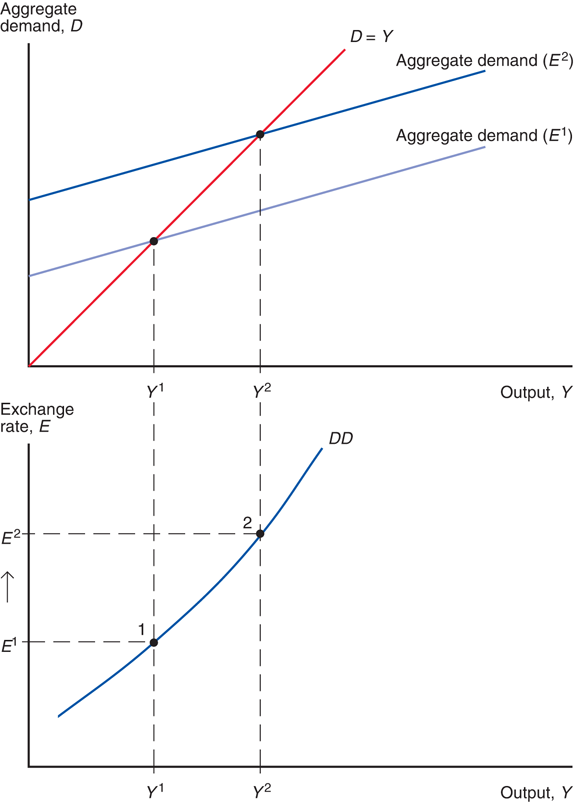

---

## Shift in DD Curve

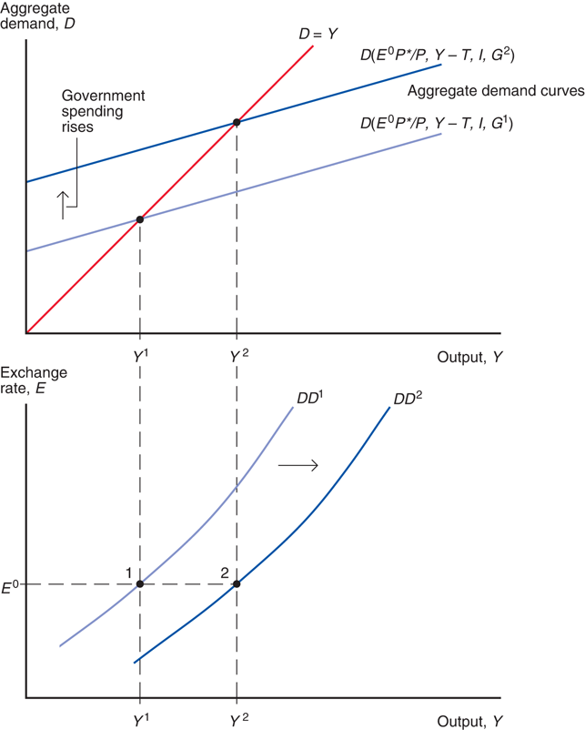

---

## Currency Effect of Higher Output

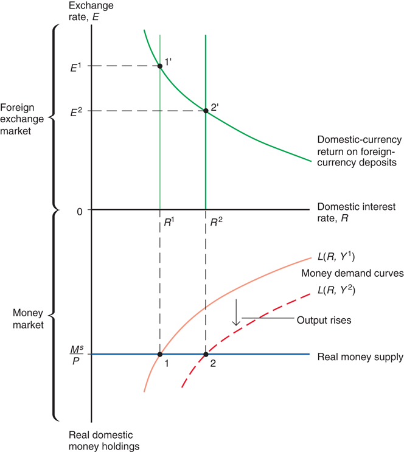

---

## AA Schedule

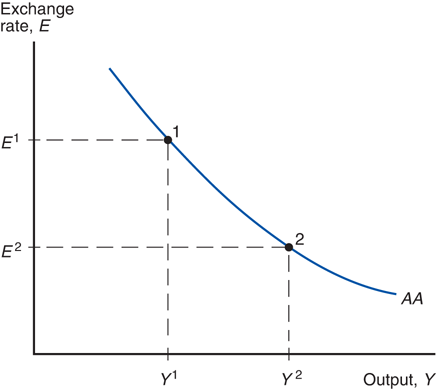

- All else equal, higher output lowers exchange rate

- Exogenous: $(M^s,P,R^*,E^e)$; endogenous: $(R,Y,E)$

---

## Equilibrium Output and Exchange Rate

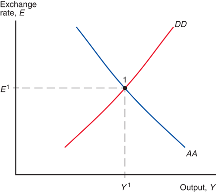

- Output market equilibrium on DD curve
- Asset market equilibrium on AA curve
- Simultaneous equilibrium occurs at intersection

---

## Temporary Monetary Expansion

- $M^s\uparrow$ with expected $M^s\downarrow$ $\Rightarrow$ $E^e$ unchanged

- $M^s\uparrow$ $\Rightarrow$ $R\downarrow$ $\Rightarrow$ $E\uparrow$ $\Rightarrow$ $D\uparrow$ $\Rightarrow$ $Y\uparrow$

---

## Temporary Fiscal Expansion

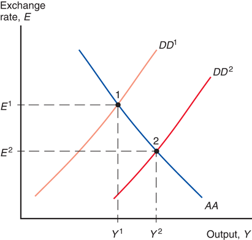

- $G\uparrow$ with expected $G\downarrow$ $\Rightarrow$ $E^e$ unchanged

- $G\uparrow$ $\Rightarrow$ $Y\uparrow$ $\Rightarrow$ $L(R\uparrow,Y)=M^s/P$ $\Rightarrow$ $E\downarrow$

---

## Restoring Full Employment

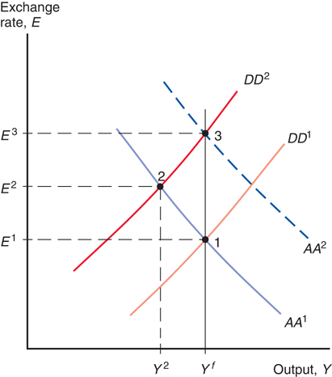

- Temporary demand shift towards foreign goods ($1\rightarrow 2$)

- M expansion ($2\rightarrow 3$); F expansion ($2\rightarrow 1$)

---

## Restoring Full Employment (Cont'd)

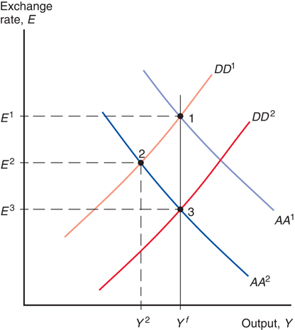

- Temporary increase in money demand ($1\rightarrow 2$)

- M expansion ($2\rightarrow 1$); F expansion ($2\rightarrow 3$)

---

## Permanent Monetary Expansion

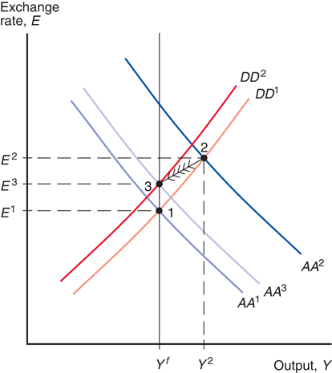

- $M^s\uparrow$ with no future reversal $\Rightarrow$ $(P^e,E^e)\uparrow$

- $M^s\uparrow$ $\Rightarrow$ $E\uparrow$, $Y\uparrow$ $\Rightarrow$ $P\uparrow$ $\Rightarrow$ $D\downarrow$, $M^s/P\downarrow$ $\Rightarrow$ $E\downarrow$, $Y\downarrow$

---

## Permanent Fiscal Expansion

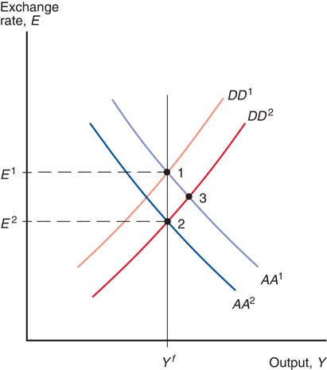

- $G\uparrow$ with no future reversal $\Rightarrow$ $E^e\downarrow$

- $G\uparrow$ $\Rightarrow$ $Y\uparrow$, $R\uparrow$ $\Rightarrow$ $E\downarrow$; $E^e\downarrow$ $\Rightarrow$ $E\downarrow$ $\Rightarrow$ $Y\downarrow$

---

## Macro Policies & Current Account

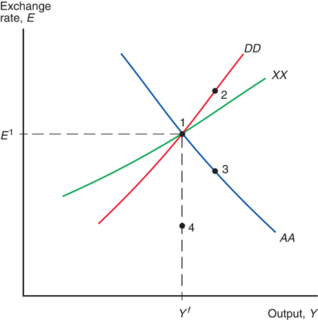

- XX curve: $CA(EP^*/P,Y-T)=X$ (constant)

- Effects of temporary/permanent MP/FP on CA?

---

## J-Curve

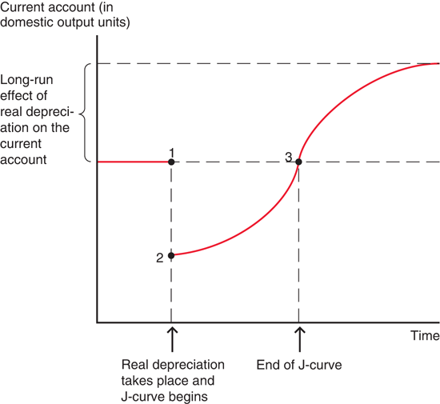

- $1\rightarrow 2$: value effect dominates, $CA\downarrow$ immediately

- $2\rightarrow 3$ & beyond: volume effect takes over

---

## Liquidity Trap

- Set $R=0$ (ZLB), interest parity: $E=E^e/(1-R^*)$

- With fixed $E^e$, M expansion becomes ineffective

- Unconventional monetary policies

---

## Readings & Exercises

- Readings
  - KOM: chapter 17

- Exercises
  - KOM: problem 1, 2, 3, 4
  - In-class quiz: problem 14
  - What are effects of temporary/permanent MP/FP on CA? Hint: M expansion improves CA; F expansion worsens CA
