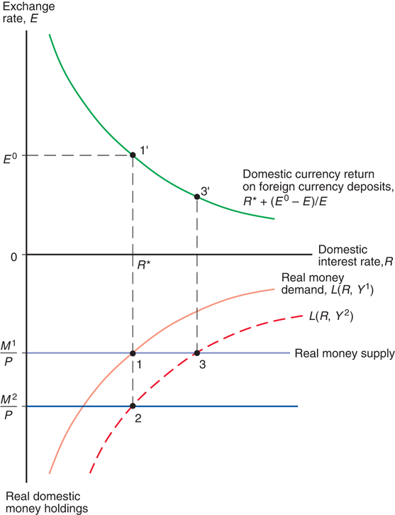
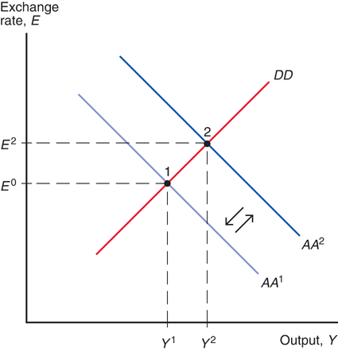
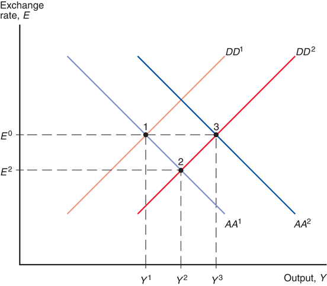
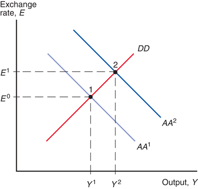
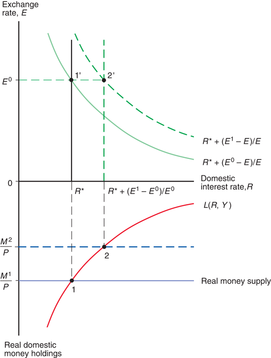
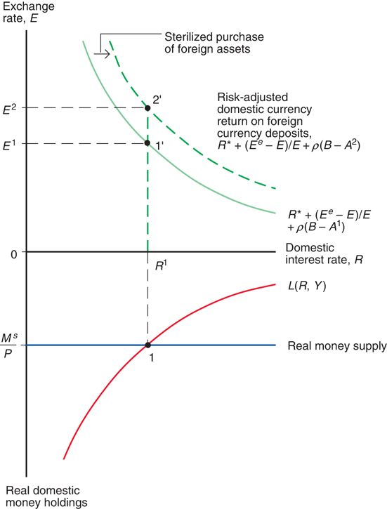

# Lecture 7: Fixed Exchange Rates and Foreign Exchange Intervention

**Instructor:** Fei Tan

 @econdojo &nbsp;&nbsp;&nbsp;&nbsp;  @BusinessSchool101 &nbsp;&nbsp;&nbsp;&nbsp;  Saint Louis University

**Course:** International Macroeconomics  
**Date:** February 1, 2026

---

## A Tale of Two Regimes

**Real exchange rate approach**

$${\color{red}E}=q\times\frac{P}{P^*}=q\times{\color{red}\frac{M^s}{M^{*s}}}\times\frac{L(R^*,Y^*)}{L(R,Y)}$$

- **Floating exchange rate regime**
  - $M^s$ ($M^{*s}$) determined by central bank
  - $E$ determined by market

- **Fixed exchange rate regime**
  - $E$ determined by central bank
  - $M^s$ ($M^{*s}$) determined by market
  - gold standard (1870–WW1), reserve currency (WW2–1973)

- **Hybrid regime** of 'managed' floating exchange rates

---

## The Road Ahead

1. [Central Bank Intervention and Money Supply](#central-bank-balance-sheet)
2. [How Central Banks Fix Exchange Rate](#pegging-exchange-rate)
3. [Stabilization Policies under Fixed Exchange Rate](#monetary-policy)
4. [Sterilized Intervention under Managed Floating Regime](#asset-substitutability)

---

## Central Bank Balance Sheet

| Assets | | Liabilities | |
|:---|---:|:---|---:|
| Foreign assets | $1,000 | Reserves | $500 |
| Domestic assets | $1,500 | Currency | $2,000 |

- **Examples of assets**
  - international reserves: foreign gov't bonds, gold
  - domestic gov't bonds
  - loans to domestic banks (discount loans in U.S.)

- **Examples of liabilities**
  - reserves: deposits by private banks
  - currency in circulation

- **Monetary base/high-powered money**: reserves + currency

---

## Foreign Exchange Intervention

| Assets | | Liabilities | |
|:---|---:|:---|---:|
| Foreign assets | $900 | Reserves | $500 |
| Domestic assets | $1,500 | Currency | $1,900 |

- Example of nonsterilized intervention
    - sale of $100 foreign bonds
    - domestic money supply $\downarrow$ by more than $100

| Assets | | Liabilities | |
|:---|---:|:---|---:|
| Foreign assets | $900 | Reserves | $500 |
| Domestic assets | $1,600 | Currency | $2,000 |

- Example of sterilized intervention
    - sale of $100 foreign bonds, purchase of $100 domestic bonds
    - domestic money supply _unchanged_

---

## Pegging Exchange Rate

**Nominal interest parity revisited**

$$R=R^*+\frac{E^0-E}{E}\quad\text{(set }\color{red}E^e=E^0\text{)}$$

- Central bank intervenes when equilibrium exchange rate falls below target, $E<E^0$ (PICTURE below!)
  - interest parity implies $R>R^*$
  - $E^0$ creates excess euro S, excess dollar D
  - central bank purchases euro bonds
  - euro D curve $\rightarrow$, dollar S curve $\rightarrow$
  - $E\uparrow$ ($1/E\downarrow$) to $E^0$ ($1/E^0$)

- To fix $E=E^0$, central bank influences currency supply and demand by trading foreign assets until $R=R^*$

---

## Graphical Analysis

---

## Monetary Policy

- Purchase of domestic assets + sale of foreign assets

- MP is ineffective under fixed exchange rate

---

## Fiscal Policy

- Tax cut + purchase of foreign assets

- FP is more potent under fixed than floating exchange rate

---

## Effect of Currency Devaluation

- Devaluation/revaluation: rise/fall in exchange rate target

- $E\uparrow$ $\Rightarrow$ $Y\uparrow$ $\Rightarrow$ $\frac{M^s\uparrow}{P}=L(R,Y)$ (buy foreign assets)

---

## Balance of Payments Crisis

---

## Asset Substitutability

**Foreign exchange market equilibrium**

$$R=R^*+\frac{E^e-E}{E}+\rho(B-A)$$

- Substitutability b/w home and foreign currencies
  - $B-A$ = domestic bonds held by _market_  
    (domestic bonds less those held by central bank)
  - $\rho$ = risk premium on risky domestic assets  
    $B-A\uparrow$ $\Rightarrow$ $\rho\uparrow$ (default/exchange rate risk)
  - $\rho=0$: perfect substitutes, only return matters  
    $\Rightarrow$ sterilized intervention becomes ineffective
  - $\rho>0$: imperfect substitutes $\Rightarrow$ interest differential

---

## Effect of Sterilized Intervention

---

## Readings & Exercises

- **Readings**
  - KOM: chapter 18

- **Exercises**
  - KOM: problem 1, 2, 3, 4
  - Graphically illustrate how must central bank intervene when equilibrium exchange rate rises above target? EXPLAIN your results.
